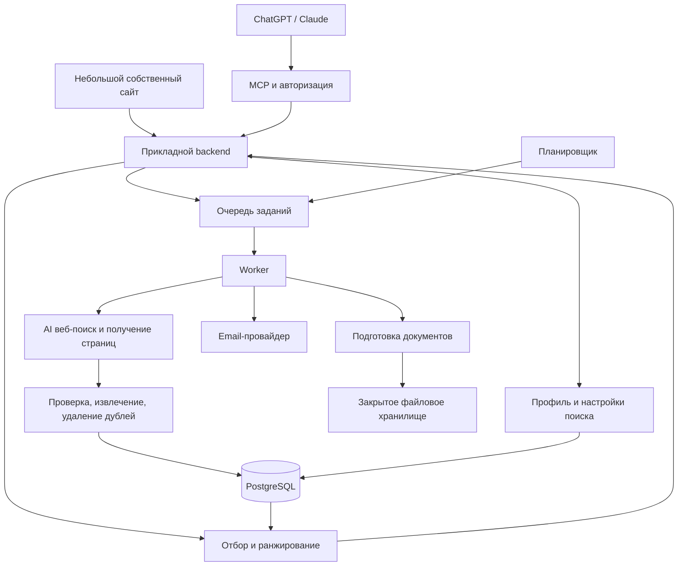

# AI-сервис поиска вакансий у работодателей

Описание продукта и архитектуры для старта разработки.

- **Дата:** 18 сентября 2026 года.
- **Версия документа:** 0.1.
- **Начальный масштаб:** два пользователя с перспективой роста.
- **Статус:** основа проекта по итогам обсуждения. Технические предложения, которые ещё не выбраны окончательно, отмечены отдельно.
- **Рабочее название:** не определено.
- **Основные интерфейсы:** ChatGPT и Claude через MCP; небольшой собственный сайт для необходимых операций.

## 1. Назначение продукта

Сервис помогает кандидату находить подходящие вакансии напрямую у работодателей, управлять поиском естественным языком, получать новые позиции на email и готовить адаптированные CV и cover letter.

Основная ценность — найденные и проверенные вакансии, персонализация по реальному опыту и предпочтениям, актуальность результатов и сокращение времени подготовки отклика.

Пользователь взаимодействует с привычным AI-ассистентом. Наш backend отвечает за постоянное хранение данных, выполнение поиска, проверку источников, фоновые задания, документы и уведомления.

**AI-first означает:** пользователь задаёт цель и уточняет её в разговоре; система переводит это в структурированные действия, показывает основания результатов и сохраняет состояние между разговорами. Критичные правила доступа, расписания, лимиты и обязательные ограничения проверяются программно.

Продукт не обещает найти все вакансии в интернете, гарантировать достоверность каждого объявления или обеспечить трудоустройство.

## 2. Зафиксированные требования

1. Профиль кандидата создаётся из CV, ответов на вопросы агента или их сочетания.
2. Поиск ориентирован на карьерные страницы компаний и официальные страницы их систем найма. LinkedIn, Xing и аналогичные агрегаторы не являются целевыми источниками выдачи.
3. Пользователь может добавлять специфику, менять обязательные условия, предпочтения и исключения обычным разговором.
4. Найденные вакансии сохраняются в стандартизированном виде и повторно используются.
5. Сохранённые поиски обновляются по расписанию. Новые подходящие вакансии отправляются на email после включения уведомлений пользователем.
6. Для выбранной позиции создаются адаптированное CV и cover letter на основе фактов об опыте кандидата.
7. Система начинается с двух пользователей. Архитектура должна позволять увеличивать объём данных и число фоновых обработчиков без переписывания основных модулей.
8. Монетизация предполагается в будущем. Прайсинг и платёжные интеграции не входят в текущий этап.

## 3. Границы MVP

### Входит

- Авторизация и изоляция данных двух пользователей.
- Загрузка PDF/DOCX с резюме и ввод сведений текстом.
- Структурированный профиль с источниками фактов и историей изменений.
- Несколько независимых поисков на одного кандидата.
- AI веб-поиск с проверкой найденных страниц.
- Общая база публичных вакансий и персональная выдача.
- Объяснение соответствия, сохранение и скрытие вакансий.
- Уточнение поиска через диалог.
- Фоновые обновления и email с новыми результатами.
- Генерация, редактирование и экспорт CV и cover letter.
- MCP-интеграция сначала с одной платформой; подключение второй к тому же backend.
- Наблюдение за ошибками, стоимостью и результативностью запусков.

### За пределами MVP

- Автоматическая отправка заявок работодателям.
- Массовый обход всех компаний или всех вакансий в интернете.
- Полноценная система управления наймом для работодателей.
- Отдельная векторная база, кластер поискового движка и микросервисы.
- Сеть автономных агентов без подтверждённой необходимости.
- Сложный интерфейс с собственным универсальным чатом.
- Обучение собственной модели и автоматическое обучение на отказах пользователя.
- Биллинг, тарифы и публичная публикация в каталогах до проверки основного сценария.

## 4. Выбранная архитектурная стратегия

**На старте: поиск по запросу с накоплением базы и выборочным фоновым обновлением.**

Первый поиск может в основном обращаться к вебу. Найденные позиции проходят проверку и сохраняются. Следующие запросы используют накопленные данные и при необходимости дополняются новыми результатами.

Фоновые задания обслуживают активные поиски и уже обнаруженные востребованные источники. Сбор не расширяется на весь рынок автоматически.

**Целевая эволюция:** всё больше запросов получает полезную первую выдачу из собственной базы; фоновое обнаружение расширяет покрытие, а поиск во время запроса закрывает пробелы.

На старте embeddings не обязательны. Векторный поиск добавляется после измерений, если объём сохранённых данных делает отбор слишком медленным или дорогим.

### Почему этот вариант

- Позволяет проверить пользу продукта до создания большой инфраструктуры сбора.
- Не требует заранее подготовленного каталога работодателей.
- Повторно использует результаты и уменьшает дублирование внешней работы.
- Поддерживает регулярные уведомления и историю изменений.
- Совместим с будущим гибридным поиском и увеличением числа workers.

## 5. Основной пользовательский путь

### 5.1. Создание профиля

1. Пользователь связывает аккаунт сервиса с AI-клиентом.
2. Передаёт CV или просит агента провести короткое интервью.
3. Система извлекает опыт, проекты, навыки, образование и языки.
4. Пользователь видит черновик профиля и может исправить неточности.
5. Агент уточняет только сведения, необходимые для ближайшего действия.
6. Создаётся версия профиля, пригодная для поиска.

Не нужно требовать полностью заполненный профиль до первой полезной выдачи. Детали достижений можно уточнять позже, при подготовке документов.

### 5.2. Запуск поиска

1. Пользователь описывает желаемую работу.
2. AI выделяет цели, обязательные условия, предпочтения и исключения.
3. Краткая карточка показывает, как система поняла запрос.
4. Backend проверяет сохранённые вакансии и при необходимости запускает веб-поиск.
5. Пользователь получает результаты с объяснениями и источниками.

### 5.3. Уточнение выдачи

Пользователь может сказать: «только удалённо», «добавь Швейцарию», «больше задач по архитектуре», «исключи консалтинг», «покажи сначала свежие».

Система определяет область изменения: профиль, настройки конкретного поиска или только текущий вид выдачи. Однозначные изменения применяются с коротким объяснением и возможностью отмены. При существенной неоднозначности задаётся один уточняющий вопрос; независимую понятную часть можно выполнить сразу.

### 5.4. Мониторинг

Пользователь включает регулярный поиск, выбирает частоту и подтверждённый email. Первый запуск формирует исходную подборку. Следующие письма содержат новые подходящие позиции. Поиск можно приостановить, изменить или отключить.

### 5.5. Подготовка отклика

Пользователь выбирает вакансию либо передаёт прямую ссылку. Сервис проверяет её, оценивает соответствие, подбирает опыт и создаёт CV и cover letter. Пользователь видит изменения, редактирует документы и скачивает файлы. Переход и отправка отклика работодателю выполняются пользователем.

## 6. Общая схема системы



Модули находятся в одном проекте. API/MCP и worker используют одну прикладную логику, но могут запускаться разными процессами. Планировщик создаёт задания; он не выполняет долгий поиск внутри своего вызова.

## 7. Ответственность модулей

| Модуль | Ответственность |
|---|---|
| Identity | Пользователи, сессии, OAuth, права доступа |
| Candidate | Профиль, факты, источники, уточнения, версии |
| Search | Настройки, изменения, план запросов, запуски |
| Discovery | Обнаружение вакансий, компаний и карьерных страниц |
| Ingestion | Получение страниц, проверка происхождения, стандартизация |
| Jobs | Канонические вакансии, версии, дубли и актуальность |
| Matching | Ограничения, оценка соответствия, объяснения |
| Monitoring | Расписания, выборочная актуализация, новые совпадения |
| Documents | Адаптация, проверка фактов, шаблоны и экспорт |
| Notifications | Подборки, очередь отправки, доставка и отписка |
| Operations | Задания, лимиты, диагностика и измерения качества |

MCP — интерфейс к этим модулям. Бизнес-логика не должна зависеть от конкретного MCP-клиента.

## 8. Профиль кандидата

Разделяются фактический опыт и будущие карьерные предпочтения. Прошлое резюме не должно автоматически определять желаемую следующую роль.

### Содержание

- Места работы, роли и даты.
- Обязанности и область ответственности.
- Проекты, личный вклад и достижения.
- Навыки и контекст их использования.
- Образование, сертификаты, языки.
- Сведения, необходимые для проверки ограничений, если пользователь их предоставил.

### Происхождение фактов

У факта сохраняются идентификатор, содержание, источник, ссылка на фрагмент или ответ, статус и версия.

Статусы: `extracted`, `confirmed`, `needs_clarification`.

`confirmed` означает подтверждение пользователем, а не внешнюю проверку его биографии. Явные однозначные сведения из CV можно использовать с сохранением происхождения. Неоднозначные выводы, новые цифры и существенные предположения требуют уточнения.

Навык, встречающийся в описании проекта, не превращается автоматически в экспертный уровень. Участие в проекте не превращается в руководство им.

## 9. Модель управляемого поиска

Один кандидат может иметь несколько поисков с разными целями и расписаниями.

| Поле | Назначение |
|---|---|
| `goal` | Краткая цель пользователя |
| `target_roles` | Целевые роли и допустимые близкие направления |
| `hard_constraints` | Обязательные условия |
| `preferences` | Пожелания, влияющие на порядок |
| `exclusions` | Исключённые компании, категории и условия |
| `unknown_policy` | Как показывать позиции с непроверенными условиями |
| `schedule` | Частота, часовой пояс, состояние мониторинга |
| `version` | Версия поисковых настроек |

«Больше fintech» повышает приоритет отрасли. «Только fintech» создаёт обязательное условие. «Сначала свежие» может менять только отображение.

AI формирует структурированное предложение изменения. Backend проверяет разрешённые поля, значения, владельца и ожидаемую версию. При конфликте версий обновление повторно согласуется с актуальным состоянием; чужие изменения не перезаписываются молча.

Отказ от одной вакансии скрывает только эту вакансию. Обобщённые предпочтения на основе нескольких отказов сначала предлагаются пользователю.

## 10. Поисковый процесс

### 10.1. Поиск по сохранённым данным

1. Прочитать актуальные версии профиля и поиска.
2. Получить известные вакансии с учётом статуса и давности проверки.
3. Удалить явно несовместимые результаты и персонально скрытые позиции.
4. Выполнить оценку соответствия.
5. Определить, достаточно ли полезных и свежих результатов для первой выдачи.

Количество карточек само по себе не подтверждает качество покрытия.

### 10.2. Планирование веб-запросов

AI строит ограниченный план: точные роли, альтернативные названия, задачи, навыки, география, языки и типы компаний. План может уточняться по результатам, но обязательные условия не ослабляются без решения пользователя.

В поисковые запросы передаются профессиональные критерии. Имя, email, телефон и полный CV не нужны для обнаружения вакансий в публичном вебе.

### 10.3. Условия дополнительного веб-поиска

- Недостаточно подходящих результатов.
- Слабое соответствие найденных позиций задачам пользователя.
- Значимая часть данных устарела.
- Новая география, специализация или тип компаний.
- Пользователь явно просит расширение или обновление.

Каждый запуск имеет лимиты времени, числа запросов и расходов. Условия остановки: достигнут полезный результат, исчерпан бюджет или несколько последовательных направлений не дали новых полезных позиций. Это не означает, что рынок исследован полностью.

### 10.4. Проверка источника

Нужно открыть конечную страницу и установить, что это конкретная вакансия работодателя. Официальная страница компании на ATS, например Greenhouse или Lever, допустима. Сам домен ATS не доказывает принадлежность объявления нужной компании.

Поисковый snippet служит для обнаружения, но не является достаточным основанием для подтверждения всех условий вакансии. При невозможности прочитать источник результат получает непроверенный статус и не выдаётся как подтверждённый.

### 10.5. Получение содержания

Предпочтительный порядок: доступные структурированные данные или официальный feed/API; разметка `JobPosting`; HTML; браузер для необходимого динамического содержимого. Соблюдаются правила доступа и ограничения источника. Обход защит не входит в MVP.

### 10.6. Стандартизация

Сохраняются компания, название, URL, номер вакансии у работодателя, локации, формат работы, тип занятости, зарплата с валютой и периодом, требования, обязанности, язык, дата публикации при наличии, время обнаружения и проверки.

Неизвестные значения остаются неизвестными. Различаются валюта и период выплаты, требования к месту проживания и общая пометка remote, обязательные и желательные навыки.

Помимо полей сохраняется необходимый текст вакансии или достаточные выдержки с источниками. Один краткий AI-summary не заменяет исходные основания для оценки и генерации документов. Объём и сроки хранения исходных материалов задаются отдельно.

### 10.7. Дубли

Приоритет идентификации: источник и внешний номер вакансии; канонический URL; затем компания, роль, локации и содержание.

Сходство текста помогает выявить возможный дубль, но само по себе не является основанием объединить разные вакансии. Tracking-параметры можно убрать; параметры, идентифицирующие позицию, сохраняются. Несколько локаций одной позиции не обязательно означают несколько независимых вакансий.

### 10.8. Ранжирование

Сначала проверяются обязательные условия. Для каждого условия результат: `match`, `mismatch` или `unknown`. Затем оцениваются задачи, опыт, предпочтения и пробелы.

Модель возвращает объяснение с привязкой к фактам профиля и вакансии. Внутренняя оценка не представляется пользователю как вероятность получения оффера.

Нужны умеренное разнообразие компаний и защита от выдачи множества почти одинаковых позиций. Эти правила применяются после проверки обязательных условий.

## 11. Актуальность и фоновые процессы

### Два вида фоновой работы

1. **Discovery:** повторить активные поиски и найти новые компании или вакансии.
2. **Refresh:** проверить уже известные востребованные источники и позиции.

Источник хранит адрес, тип, способ получения данных, последнюю успешную проверку, следующую запланированную попытку и состояние ошибок. Этот реестр создаётся из обнаруженных источников, а не заполняется всем рынком заранее.

Источники с полезными результатами и активными поисками получают более высокий приоритет. Небольшая часть бюджета сохраняется для обнаружения новых компаний. Частота адаптируется к результативности и изменениям, с учётом ограничений сайта.

### Статус вакансии

Жизненный цикл вакансии (`open`, `closed`, `unknown`) хранится отдельно от результата последней попытки доступа (`success`, `unavailable`, `blocked`, `parse_error`).

Ошибка загрузки не закрывает позицию. Исчезновение из поисковой выдачи также не является доказательством закрытия. Нужны явные признаки: сообщение работодателя, прошедший срок действия или устойчивое подтверждение удаления с проверкой возможного переноса.

Период допустимой давности проверки — настраиваемая политика. Перед уведомлением или подготовкой отклика устаревшая запись перепроверяется. Неудача отображается честно.

### Изменение настроек во время работы

Запуск фиксирует входные версии. Публичные найденные вакансии можно сохранить даже при изменении поиска, но персональная выдача и уведомления должны соответствовать актуальным настройкам. Старые задания не возвращают скрытые пользователем позиции и не возобновляют остановленный мониторинг.

## 12. Email с новыми вакансиями

Уведомления включаются явно для подтверждённого адреса. Пользователь выбирает частоту, часовой пояс и при необходимости максимальный размер подборки.

Процесс: обнаружение и проверка → сопоставление с актуальным поиском → проверка истории показов и отправок → создание подборки → очередь отправки → обработка статуса доставки.

В письме: название, компания, основные условия, краткое основание рекомендации и ссылка. При необходимости есть ссылка на сервис для подготовки документов. Работоспособность ссылки на продолжение в конкретном AI-клиенте проверяется отдельно; она не предполагается автоматически.

Различаются:

- новая для пользователя вакансия;
- недавно опубликованная вакансия с подтверждённой датой;
- изменившиеся условия известной позиции;
- старая позиция, которая стала подходить после изменения критериев.

По умолчанию при отсутствии новых подходящих позиций письмо не отправляется. При нескольких пересекающихся поисках позиция не должна многократно попадать одному пользователю в одну подборку.

Идемпотентность обеспечивается идентификатором подборки и записями доставки. Если email-провайдер принял запрос, но ответ потерян, нельзя безусловно отправлять повторно: требуется ключ идемпотентности провайдера или сверка статуса. Абсолютная гарантия доставки «ровно один раз» без поддержки провайдера не обещается.

Нужны отписка, пауза, обработка bounce и suppression. Ошибки поиска не маскируются под успешную пустую подборку.

## 13. Подготовка CV и cover letter

### Вход

- Конкретная версия профиля.
- Конкретная версия вакансии и время её проверки.
- Язык, формат, желаемый объём и выбранный шаблон.
- Дополнительные пожелания пользователя.

### Процесс

1. Выделить требования вакансии.
2. Связать их с фактами опыта.
3. Сформировать план адаптации и определить существенные пробелы.
4. Если необходимо, запросить конкретный факт.
5. Сгенерировать структурированное содержание CV и письма.
6. Проверить утверждения, даты, числа, названия и согласованность документов.
7. Отрендерить файлы через шаблоны.
8. Проверить извлечённый текст и визуальное оформление.
9. Сохранить версию и описание изменений.

Факты, числа, должности и личный вклад не выдумываются. Знание технологии не добавляется только потому, что она требуется работодателю. Утверждения о компании также должны иметь основание или исключаться.

AI отвечает за содержание; шаблоны — за оформление. Изменение текста пользователем создаёт новую версию. Исходное CV не перезаписывается. При обновлении профиля готовые документы не изменяются без нового действия пользователя.

Ссылки на скачивание ограничены по времени и выдаются только владельцу. Файлы и личные достижения не попадают в общую базу вакансий.

## 14. Модель данных

Названия ниже — предлагаемые сущности, а не обязательная окончательная схема таблиц.

| Сущность | Основные данные и связи |
|---|---|
| `users` | Идентификатор, подтверждённый email, язык, часовой пояс |
| `candidate_profiles` | Владелец, текущая версия, структурированный профиль |
| `profile_versions` | Снимки профиля и основания изменений |
| `candidate_facts` | Опыт, источник, статус, версия, владелец |
| `source_documents` | Личные загруженные файлы, извлечение и состояние обработки |
| `searches` | Владелец, цель, текущая версия и расписание |
| `search_versions` | Ограничения, предпочтения, исключения и история изменений |
| `search_runs` | Входные версии, план, статус, прогресс, расходы и ошибки |
| `companies` | Нормализованная компания и официальный домен |
| `sources` | Карьерные страницы, ATS, способ чтения и актуализация |
| `jobs` | Каноническая вакансия, статус и текущая версия |
| `job_versions` | Содержание, извлечённые поля, доказательства и изменения |
| `candidate_job_matches` | Кандидат, поиск, вакансия, версии, оценка и объяснение |
| `job_feedback` | Сохранение, скрытие, причина отказа, отметка об отклике |
| `application_packages` | Версии профиля и вакансии, CV, письмо, файлы и изменения |
| `notification_batches` | Подборки, владелец, состав и ключ идемпотентности |
| `notification_deliveries` | Состояние отправки, provider ID, ошибки |
| `background_tasks` | Тип, параметры, lease, попытки, приоритет, состояние |

Публичные данные вакансий можно переиспользовать. Персональные связи, документы и доказательства опыта изолируются по владельцу. Авторизация применяется до выдачи данных, включая результаты фоновых заданий.

## 15. MCP и прикладной API

Предлагаемый минимальный набор операций:

| Операция | Результат |
|---|---|
| `get_profile` | Текущий профиль и существенные пробелы |
| `update_profile` | Проверенное изменение и новая версия |
| `create_search` | Сохранённая поисковая цель |
| `update_search` | Изменение условий с проверкой версии |
| `run_search` | Быстрые результаты при наличии и/или фоновое задание |
| `get_search_results` | Выдача, объяснения, курсор и состояние дополнения |
| `get_task_status` | Прогресс и результат длительной операции |
| `set_job_feedback` | Сохранение, скрытие или отметка об отклике |
| `configure_monitoring` | Расписание, адрес и состояние уведомлений |
| `prepare_application` | Задание создания CV и cover letter |
| `get_application_package` | Предпросмотр, изменения и доступные файлы |

Конкретные имена и схемы уточняются при реализации. Инструменты имеют узкие входы и точные описания побочных эффектов. Идентификатор владельца определяется сервером по авторизации, а не принимается на доверии из аргументов модели.

Долгие операции не удерживают один MCP-вызов до завершения. Клиент получает состояние и может запросить продолжение. Нельзя считать, что любой клиент автоматически покажет фоновые результаты без нового обращения.

Загрузка файлов проверяется отдельно для каждой платформы. Запасной сценарий — защищённая форма загрузки на своём сайте. Не предполагается автоматический доступ сервера ко всем файлам, памяти и истории пользователя в ChatGPT или Claude.

Фоновые поиски выполняются собственными API-вызовами backend и не зависят от активности пользователя в чате.

## 16. AI, RAG и векторный поиск

### AI в MVP

- Извлечение фактов из документов.
- Уточняющие вопросы.
- Интерпретация изменений поиска.
- Планирование веб-запросов.
- Извлечение требований из нестандартных страниц.
- Оценка соответствия и объяснения.
- Подготовка документов.

### Детерминированная логика

- Авторизация и изоляция данных.
- Проверка структурированных схем.
- Версии, расписания и состояния заданий.
- Идемпотентность и история уведомлений.
- Проверка явных ограничений по извлечённым полям.
- Бюджеты, ограничения времени и повторные попытки.

### RAG

Для объяснений и документов сначала выбираются конкретные записи вакансии и подтверждённые факты кандидата. При небольшом профиле можно передать его целиком. RAG здесь означает генерацию с извлечёнными основаниями; отдельная векторная база для этого не обязательна.

### Когда добавлять embeddings

Основание — измеренная проблема со скоростью, расходами или смысловым отбором из накопленных данных. Потенциальные сценарии: похожие вакансии, предварительный отбор, поиск проектов в длинной истории опыта и проверка возможных дублей.

Первый вариант расширения — pgvector внутри PostgreSQL. Векторный индекс является производным от версионированного текста, может быть перестроен и не заменяет исходные записи. Хранятся версия embedding-модели и версия содержимого. Личные материалы не смешиваются с публичным индексом.

## 17. Предлагаемый технический старт

Это рекомендации для реализации, а не уже утверждённый выбор конкретных сервисов.

- **Backend:** TypeScript/Node.js как единый основной стек; конкретный HTTP-фреймворк выбирается при старте. Если команде удобнее Python, границы модулей сохраняются.
- **Хранилище:** PostgreSQL для структурированных данных и начальной очереди заданий.
- **Файлы:** закрытое объектное хранилище с ограниченными ссылками на скачивание.
- **Фоновые процессы:** один worker, планировщик и таблица задач с блокировкой, lease и heartbeat.
- **AI:** один выбранный провайдер за узким внутренним адаптером. Полная взаимозаменяемость всех функций провайдеров заранее не предполагается.
- **Email:** один провайдер с API доставки и событиями статуса.
- **Документы:** структурированное содержание, шаблоны PDF/DOCX и проверка результата.
- **Сайт:** вход, загрузка файлов, необходимые настройки, документы и поддержка подключения.

### Возможная структура репозитория

```text
apps/
  server/             # HTTP API, MCP, авторизация
  worker/             # Фоновые задания
  web/                # Минимальные пользовательские страницы
packages/
  domain/             # Модули и прикладные операции
  database/           # Схема, миграции, доступ к данным
  integrations/       # AI, поиск, получение страниц, email, файлы
  document-renderer/  # Шаблоны и экспорт
  contracts/          # Проверяемые схемы входов и результатов
tests/
  integration/
  evaluations/
docs/
  architecture/
  decisions/
PROJECT.md
```

Структура иллюстративная. Для маленького проекта её можно упростить, сохранив границы ответственности. Создание всех директорий заранее не является требованием.

## 18. Надёжность и защита данных

- Задания проходят состояния `queued`, `running`, `succeeded`, `failed`, `cancelled`; ожидание уточнения пользователя учитывается отдельно.
- После падения worker истёкший lease позволяет вернуть работу в очередь.
- Повторы ограничены и используют backoff. Постоянные ошибки не вызывают бесконечный цикл.
- Изменение внешнего состояния защищено ключом идемпотентности там, где это возможно.
- Частичный успех сохраняется и честно отображается.
- Перезапуск сервиса не теряет поиски, задания и подготовленные документы.
- Есть резервное копирование базы и проверяемое восстановление.
- Секреты остаются на сервере; приватные документы не попадают в обычные журналы.
- Загружаемые файлы ограничены по типу и размеру. Ошибка разбора не превращается в выдуманное содержимое.
- Внешние страницы и CV считаются данными. Инструкции внутри них не управляют инструментами агента.
- Получение произвольных URL защищено от SSRF: внутренние адреса и нежелательные схемы блокируются, редиректы проверяются.
- Содержимое страниц и документов безопасно отображается; удалённые ресурсы при рендеринге не загружаются бесконтрольно.
- Пользователь может остановить мониторинг и удалить личные данные; удаление учитывает файлы, производные данные и политику резервных копий.

Конкретные сроки хранения, регион размещения и выбранные поставщики фиксируются до приглашения внешних пользователей.

## 19. Наблюдение за качеством

Для каждого запуска нужны входные версии, выполненные направления поиска, количество найденных и проверенных ссылок, причины отбраковки, повторы, длительность, модель и доступные сведения о расходах.

### Метрики продукта

- Число полезных вакансий в первых десяти результатах по оценке пользователя.
- Доля нарушений обязательных условий.
- Доля устаревших позиций и дублей.
- Новые подходящие вакансии при повторном запуске.
- Время до первой полезной подборки.
- Доля запросов, обслуженных из своей базы без обязательного нового веб-поиска.
- Время редактирования подготовленных документов и число неподтверждённых утверждений.

### Метрики системы

- Стоимость запуска и стоимость одной новой полезной позиции.
- Время ожидания и выполнения фоновых заданий.
- Успех получения данных по источникам.
- Возраст данных в выдаче.
- Ошибки доставки и повторные уведомления.

Полноту относительно всего интернета измерить нельзя. Нужна небольшая вручную проверенная выборка профилей и вакансий для сравнения вариантов поиска. Значения целевых порогов устанавливаются после первых запусков, а не выдаются за уже достигнутые показатели.

## 20. Проверки перед использованием MVP

Проверяются реальные риски и пользовательские сценарии, а не только соответствие кода собственной реализации.

- Пользователь A не получает профиль, файлы и историю пользователя B, в том числе через перебор идентификаторов заданий.
- Извлечение CV не добавляет отсутствующие достижения; неоднозначности явно отмечены.
- Изменение предпочтения не становится обязательным фильтром без основания.
- Скрытая позиция не возвращается из-за новой tracking-ссылки.
- Неизвестное условие не считается подтверждённым совпадением.
- Сбой страницы не помечает вакансию закрытой.
- Изменение поиска во время запуска учитывается перед рассылкой.
- Пауза и отписка блокируют уже подготовленную, но ещё не отправленную подборку.
- Повторное выполнение задания не создаёт повторных документов и писем без необходимости.
- Частичная ошибка веб-поиска сохраняет полезные результаты и видимый статус.
- CV и письмо соответствуют исходным фактам; экспорт читаем и не обрезает содержание.
- Один полный сценарий проходит через выбранный MCP-клиент, включая загрузку, получение результата и скачивание документов.

## 21. Этапы реализации

### Этап 1. Основа и профиль

Авторизация, PostgreSQL, миграции, загрузка CV, извлечение и редактирование фактов, версии профиля, минимальный MCP.

**Результат:** два пользователя независимо создают и корректируют свои профили.

### Этап 2. Полный поиск по запросу

Настройки поиска, очередь, AI веб-поиск, чтение страниц, стандартизация, дубли, оценка и выдача.

**Результат:** каждый пользователь получает проверенную подборку с источниками и может изменить условия.

### Этап 3. Подготовка документов

Пакет отклика по выбранной вакансии, уточнение опыта, проверка фактов, шаблоны, экспорт и версии.

**Результат:** можно подготовить и скачать CV и cover letter для реального отклика.

### Этап 4. Мониторинг и email

Расписание, обновление востребованных источников, обнаружение новых совпадений, журнал доставки, отписка и пауза.

**Результат:** регулярные запуски работают без открытого чата и не повторяют уже отправленные вакансии.

### Этап 5. Проверка пользы и расширение

Использование двумя пользователями, оценка качества, исправление источников ошибок, подключение второй платформы.

**Результат:** решения о vectors, дополнительных workers, источниках и провайдерах принимаются по измерениям.

## 22. Рост без смены основных принципов

| Наблюдаемая проблема | Изменение |
|---|---|
| Дорогой отбор из большого числа вакансий | Гибридный поиск с pgvector перед reranking |
| Очередь растёт | Несколько workers с контролем конкурентности |
| Повторяются похожие внешние запросы | Объединение общих discovery/refresh-заданий |
| Источник часто даёт полезные позиции | Специализированное подключение |
| Один провайдер плохо покрывает рынок | Оценка дополнительного провайдера на том же наборе |
| Не хватает пропускной способности очереди | Выделенная очередь после измерений |
| Разные задачи мешают друг другу | Отдельные пулы workers для поиска, документов и email |

Общая база накапливает публичные вакансии. Приватный профиль и настройки остаются источником персонализации. Рост базы не должен приводить к прекращению обнаружения новых работодателей.

## 23. Открытые решения

Не блокируют описание архитектуры, но должны быть выбраны перед соответствующим этапом реализации:

1. Какая платформа подключается первой: ChatGPT или Claude.
2. Основной язык backend, способ размещения и регион хранения.
3. Провайдер моделей и веб-поиска; поддержка получения динамических страниц.
4. Авторизация, загрузка файлов и минимальные страницы своего сайта.
5. Начальные профессии, география и языки двух тестовых пользователей.
6. Начальная частота обновлений и бюджеты запусков.
7. Email-провайдер, отправляющий домен и подтверждение адреса.
8. Шаблоны CV/письма и приоритет форматов PDF/DOCX.
9. Сроки хранения источников, личных документов и диагностических данных.

Публикация в каталогах ChatGPT/Claude и монетизация рассматриваются после проверки основного сценария. Правила и доступность платформ необходимо перепроверить непосредственно перед интеграцией и публикацией.

## 24. Официальные технические ориентиры

Ссылки использовались при обсуждении архитектуры; они не фиксируют версии зависимостей. Проверено в контексте проекта 18 сентября 2026 года.

- [OpenAI: MCP-сервер](https://developers.openai.com/plugins/build/mcp-server).
- [OpenAI: интерфейс MCP Apps](https://developers.openai.com/plugins/build/chatgpt-ui).
- [OpenAI: веб-поиск через API](https://developers.openai.com/api/docs/guides/tools-web-search).
- [OpenAI: правила плагинов](https://developers.openai.com/plugins/app-guidelines).
- [Claude: веб-поиск через API](https://platform.claude.com/docs/en/agents-and-tools/tool-use/web-search-tool).
- [Claude: получение веб-страниц](https://platform.claude.com/docs/en/agents-and-tools/tool-use/web-fetch-tool).
- [Claude: публикация коннектора](https://claude.com/docs/connectors/building/submission).
- [Greenhouse: Job Board API](https://docs.greenhouse.io/job-board.html).
- [Lever: Postings API](https://github.com/lever/postings-api).
- [Schema.org: JobPosting](https://schema.org/JobPosting).
- [pgvector: векторный поиск в PostgreSQL](https://github.com/pgvector/pgvector).
- [Elastic: ranking и reranking](https://www.elastic.co/docs/solutions/search/ranking).
